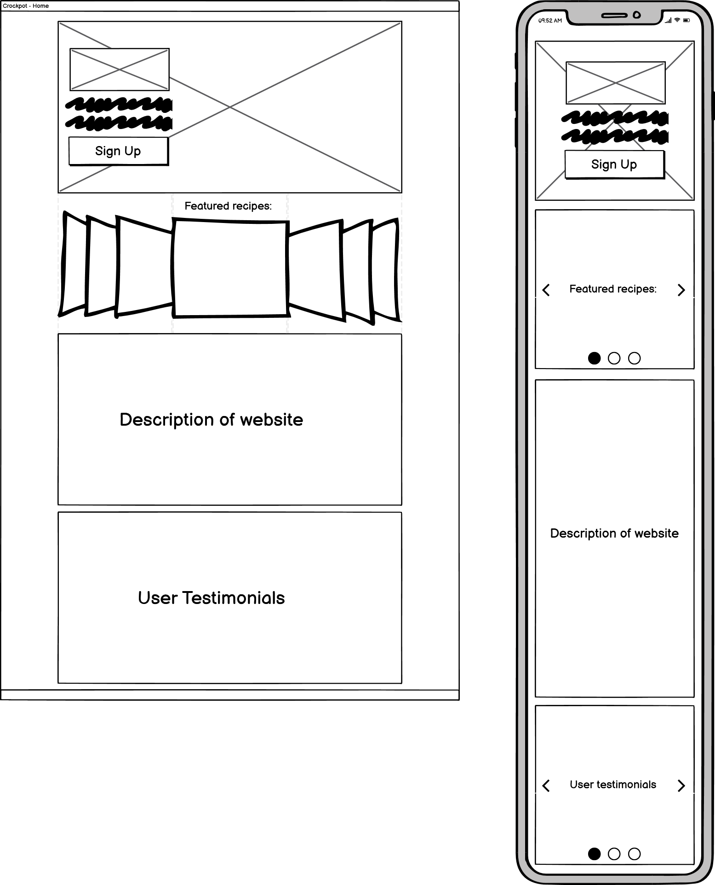
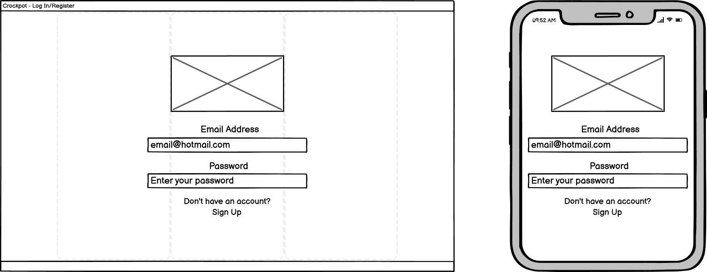
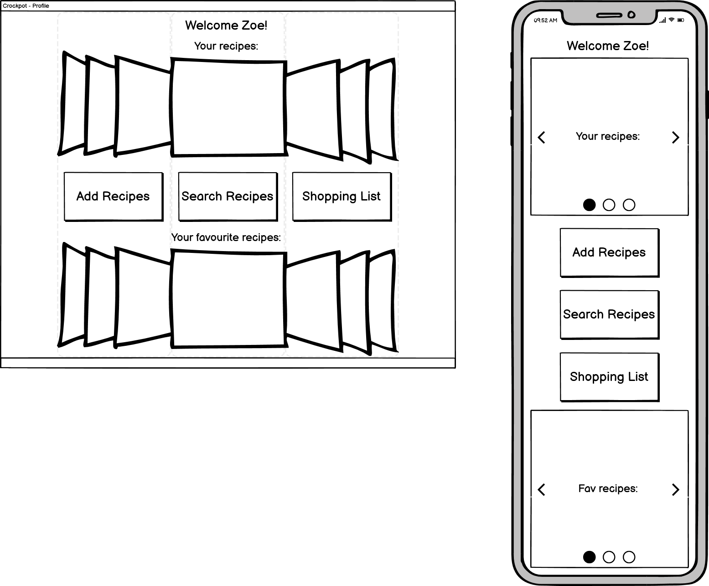
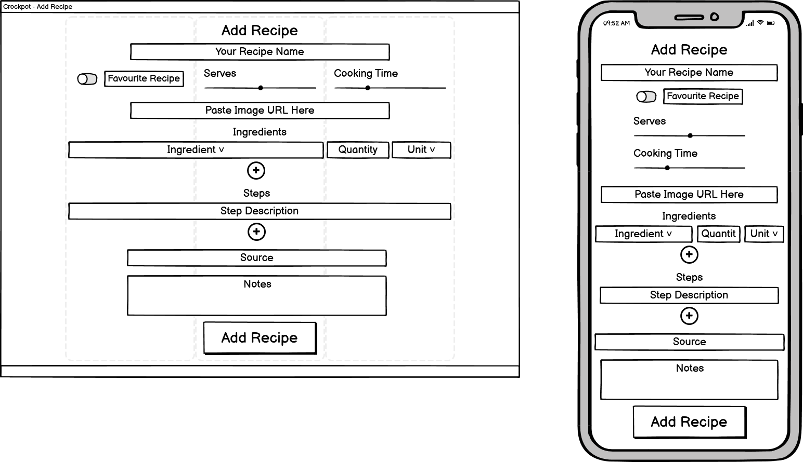
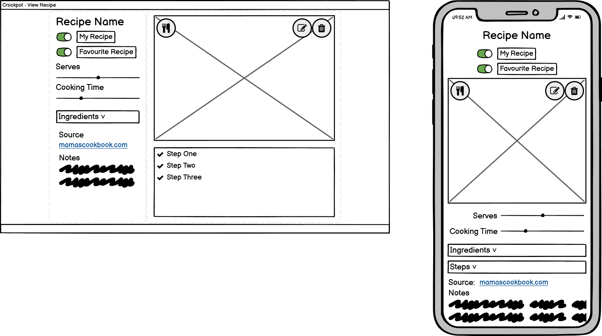
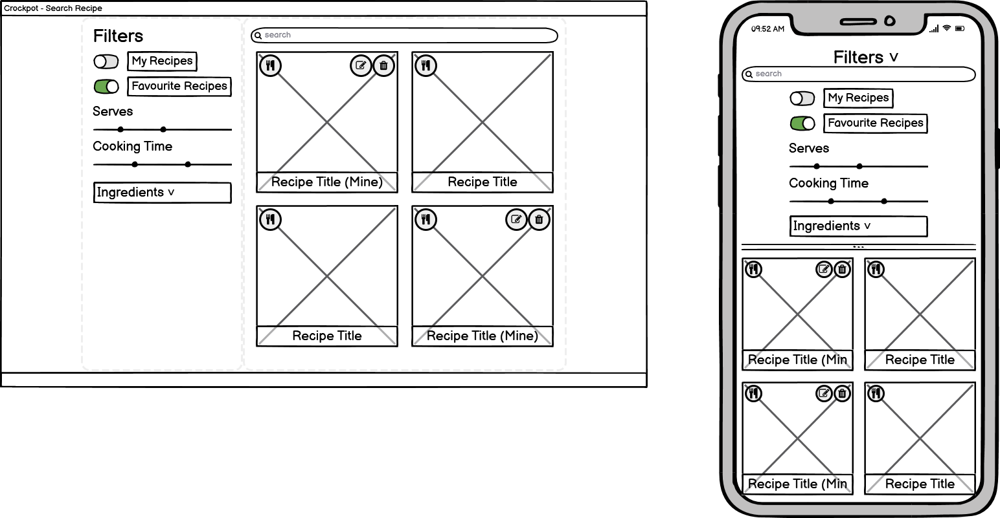
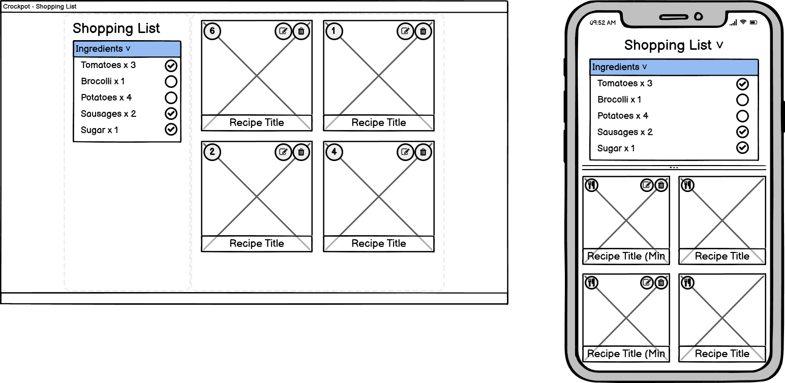

`python3 -m http.server`

# Crockpot

## Code Institute: Milestone Project 3

_Crockpot_ is a 

This was the third of four Milestone Projects required to pass the Full Stack Web Development Program at _Code Institute_. The main requirements were to build a full-stack site using HTML, CSS, JavaScript, Python, Flask and MongoDB that allows users to manage a common dataset about a particular domain.

Click [here](https://github.com/zoet24/crockpot) to view the Github repository for the project, and click [here](https://crockpot.herokuapp.com/) to view the live website.

## Table of Contents

- [UX Design](#ux-design)
    - [Design Process](#design-process)
        - [Strategy Plane](#strategy-plane)
        - [Scope Plane](#scope-plane)
        - [Structure Plane](#structure-plane)
        - [Skeleton Plane](#skeleton-plane)
        - [Surface Plane](#surface-plane)
    - [Features](#features)
        - [Existing features](#existing-features)
        - [Features left to implement](#features-left-to-implement)
- [Technologies Used](#technologies-used)
    - [Languages and frameworks](#languages-and-frameworks)
    - [Additional tools used](#additional-tools-used)
- [Git Commit Messages](#git-commit-messages)
- [Testing](#testing)
- [Deployment](#deployment)
- [Cloning](#cloning)
- [Credits](#credits)

## UX Design
### Design Process
#### Strategy Plane 

User stories:

_**Site owner**_
1. As the site owner, I want to...

_**Site users**_
1. As a site user, I want to...

#### Scope Plane
_**"Must-haves"**_
1. The site must...

_**"Nice-to-haves"**_
1. The site could...

#### Structure Plane

#### Skeleton Plane

#### Surface Plane

### Features
#### Existing features

#### Features left to implement
- Add categories to recipes for extra search functionality (eg. vegetarian, spicy, meaty etc)

## Technologies used
### Languages and frameworks
<!-- - __HTML5:__ The language used to create the content and structure of my project.
- __CSS3:__ The language used to style the HTML5 elements to create the aesthetic of my game.
- __JavaScript and JQuery:__ The language used to program my game and make aspects of the 'Home' and 'Tutorial' pages dynamic.
- __Bootstrap framework:__ I used the Bootstrap grid system to make my site responsive on different devices. I also used it for the carousel and modal components on the 'Tutorial' and 'Game' pages.
- __GitHub:__ I used GitHub to store my source code and repository.
- __GitHub Pages:__ I used GitHub Pages to deploy my project and make it viewable to others.
- __Gitpod:__ I used Gitpod's development environment to write the code for my project. -->

### Additional tools used
<!-- - __101soundboards:__ I used 101soundboards.com to find all of the sound effects used through the site.
- __Balsamiq:__ I used this to produce wireframe sketches for the site's skeleton plane.
- __CompressPNG:__ I used this to compress the images on my website to improve its performance.
- __FontAwesome:__ I used FontAwesome's database for basic icons throughout my site.
- __FreeFormatter:__ I used Freeformatter.com to format my code properly.
- __Google Developer Tools:__ I used this to test the responsiveness of my website by viewing my project on devices with different screen sizes, and to produce screenshots of the game for my 'Tutorial' page. I also used the Console to test different functions in my JavaScript code throughout development, and the Lighthouse package to test the performance of the site.
- __Google Fonts:__ I used one complementary font from Google Fonts for my project - Bowlby One SC.
- __Image Online:__ I used this to produce the graphics for my game.
- __JSHint:__ I used this to test to the validity of my JavaScript and JQuery code.
- __Paint:__ I used this to produce the graphics for my game.
- __W3C CSS Validation Service:__ I used this to test to the validity of my CSS code.
- __W3C Markup Validation Service:__ I used this to test the validity of my HTML5 code.
- __WAVE - Web Accessibility Evaluation Tool:__ I used this to test the accessibility of my website. -->

## Git Commit Messages

## Bugs
- Bug #1: getting ingredients to display correctly on viewRecipe.html

## Testing
Click [here](testing.md) to view the complete testing process.

## Deployment

## Credits
__Images:__
The background image was taken from...

__Audio:__
All audio files were downloaded from...

__Code:__
Toggle switch https://www.w3schools.com/howto/tryit.asp?filename=tryhow_css_switch
Sliders https://www.w3schools.com/howto/howto_js_rangeslider.asp
User authentication https://learn.codeinstitute.net/courses/course-v1:CodeInstitute+DCP101+2017_T3/courseware/9e2f12f5584e48acb3c29e9b0d7cc4fe/96d22c817aff4ce39e336fcb96c30e16/?child=first
Adding/deleting instructions and ingredients from addRecipe.html https://github.com/Manojlovic1998/Milestone_Project_3/blob/master/static/js/addRecipe.js

__Acknowledgements:__
I'd like to acknowledge the following tutorials and websites that I studied to complete my project. These sources have been credited in the code comments and were heavily modified for my own website.

I'd also like to thank my tutor Can Sucullu, the Code Institute community and my friends and family for their guidance and input on this project.