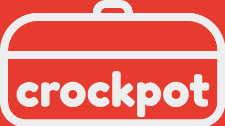

# Crockpot

## Code Institute: Milestone Project 3

_Crockpot_ is a cooking website that allows users to save all of their recipes in one convenient place, upload their old favourites to the community database, search for new inspiration based on what ingredients they have in the cupboard and generate a shopping list from their selected menu. I designed this app primarily for myself - I love cooking but hate the faff of meal planning and making shopping lists, so I wanted to design something that would make this easier for me - but it can also be used by a wider audience of cooking enthusiasts.

This was the third of four Milestone Projects required to pass the Full Stack Web Development Program at _Code Institute_. The main requirements were to build a full-stack site using HTML, CSS, JavaScript, Python, Flask and MongoDB that allows users to manage a common dataset about a particular domain.

Click [here](https://github.com/zoet24/crockpot) to view the Github repository for the project, and click [here](https://crockpot.herokuapp.com/) to view the live website.

## Table of Contents

- [UX Design](#ux-design)
    - [Design Process](#design-process)
        - [Strategy Plane](#strategy-plane)
        - [Scope Plane](#scope-plane)
        - [Structure Plane](#structure-plane)
        - [Skeleton Plane](#skeleton-plane)
        - [Surface Plane](#surface-plane)
    - [Information Architecture] (#information-architecture)
    - [Features](#features)
        - [Existing features](#existing-features)
        - [Features left to implement](#features-left-to-implement)
- [Technologies Used](#technologies-used)
    - [Languages and frameworks](#languages-and-frameworks)
    - [Additional tools used](#additional-tools-used)
- [Git Commit Messages](#git-commit-messages)
- [Testing](#testing)
- [Deployment](#deployment)
- [Cloning](#cloning)
- [Credits](#credits)

## UX Design
### Design Process
#### Strategy Plane 
I started the design process for _Crockpot_ by considering the goals of the developer (me), the site owner (me) and the site users (primarily me, secondarily a wider audience of new users and returning users who are interested in using an online cookbook).

_**Developer**_
1. As the developer, I want to create an online platform where users can add, edit, delete and search for recipes to complete the third _Code Institute_ Milestone Project.
2. As the developer, I want the website to be aesthetically pleasing to demonstrate my ability to code in HTML and CSS and to create a positive UX experience for the site users.
3. As the developer, I want the website to function well to demonstrate my ability to code in JavaScript and Python and to create a positive UX experience for the site users.

_**Site owner**_
1. As the site owner, I want the site users to have a positive UX experience while using the website so that the _Crockpot_ community grows.
2. As the site owner, I want the site users to have a positive UX experience while adding, editing and deleting recipes to increase the number of communal recipes that are shared with the website.

_**Site users**_
1. As a site user, I want to be able to add, edit and delete my own recipes so all of my recipes are saved in one place.
2. As a site user, I want feedback from the website when I add, edit and delete my recipes to show that my input has been successful.
3. As a site user, I want to be able to browse the recipes I have added when I am deciding what to cook.
4. As a site user, I want to be able to browse the recipes that other users have added when I am deciding what to cook.
5. As a site user, I want clear, well-presented information about the recipe including name, cooking time, ingredients and instructions so I know how to cook the recipe.
6. As a site user, I want to be able to save my favourite recipes so they are easier to look up when I next want to cook them.
7. As a site user, I want to be able to search the communal database for recipes based on various criteria if I am looking for a specific recipe.
8. As a site user, I want to be able to access the website from both mobile and desktop browsers so I can access the website from any of my devices.
9. As a new user, I want to be able to easily create my own profile so I can start using the website quickly.
10. As a new user, I want clear instructions on how to use the website so I can start using the website quickly.
11. As a returning user, I want to be able to easily log in to my profile so I can start using the website quickly.
12. As a site user (me), I want to be able to search the communal database for recipes based on what ingredients I have.
13. As a site user (me), I want to be able to generate a shopping list from the recipes I have selected.

#### Scope Plane
After establishing my main aims, I re-did the _Code Institute_ task manager mini project on the Backend Development module to see what features that would be realistic to implement within the time constraints of this project. I used this along with my user stories to compile a list of “must-have” features and “nice-to-have” features to include on my website. I added my requirement that the site should generate a shopping list to the “nice-to-have” list as I wasn’t sure if I would have enough time to implement it.

_**"Must-haves"**_
1. The site must be aesthetically pleasing across all devices and have a consistent theme.
2. The site must be easy to navigate and have clear instructions on how to use it.
3. New users must be able to create their own profile and returning users must be able to log in to their own profile.
4. Users must be able to add, edit and delete their own recipes, and receive feedback when they do so.
5. Information about each recipe must be clearly presented and easy to access.
6. Users must be able to “favourite” any recipe and these should display on their profile/specific page.
7. Users must be able to browse their own recipes and recipes added by other users.
8. Users must be able to search for specific recipes based on various criteria, including ingredients.

_**"Nice-to-haves"**_
1. The site could generate a shopping list based on what recipes the user has selected.
2. The site could recommend recipes to the user based on recipes they hadn’t tried before/recipes that were similar to their own/favourite recipes.
3. The site could have admin user functionality with the ability to add, edit and delete any users/recipes.
4. Users could customise aspects of their profile (eg. add profile picture, food preferences).
5. Users could connect directly with other users and view their profiles.
6. Users could rate or review recipes and this could be displayed on the recipe for other users to see.
7. Recipes could have assigned categories (eg. vegetarian, spicy, Indian) to make them easier to search for.

#### Structure Plane
Based on the features outlined in my scope and the end result of the task manager mini project, I decided that I wanted to include the following pages on my website:
- “Home”, “Search”, “Log In” and “Sign Up” when the user isn’t logged in to the site.
    - The “Home” page welcomes the user to the site and directs them to the “Log In” and “Sign Up” pages.
    - The “Search” page allows the user to browse through all the recipes on the website or search for specific recipes. Users who aren’t logged in can view recipes but they can’t add their own.
    - Individual recipes can be viewed on their own separate page by clicking on the recipe thumbnail.
    - The “Log In” and “Sign Up” pages allow the user to log in to/create their profile so they can access the full functionality of the website.
- “Profile”, “Add”, “Search” and a link to log out when the user is logged in to the site.
    - The “Profile” page shows the user’s own recipes, their favourite recipes and links to the rest of the website.
    - The “Add” page allows the user to add their own recipes through a form.

At this stage I added a “Shopping List” page to my “nice-to-have” list (which I would later rename “Menu”) - this would be a page which would generate a shopping list based on what recipes the user had added to their “Menu”. It would only be accessible if the user was logged in to the website. It was an unnecessary addition to include in the initial MVP, but I decided to be optimistic and include it in my wireframe mock-ups.

#### Skeleton Plane
I used Balsamiq to develop wireframes (click [here](README-Wireframes.md) to view them) of what I wanted my website to look like on mobile and desktop. I kept my scope at the forefront of this design process to make sure that there was going to be a place to put all of my key features.

#### Surface Plane
After finishing my Balsamiq wireframes, I designed the _Crockpot_ logo and favicon using HTML5 and CSS. I chose “Fredoka One” for the logo font as I thought the rounded curves of the typeface matched the round features of the logo. I continued this theme throughout the website, opting for rounded corners and circles on buttons, icons and images. I didn’t want to use "Fredoka One" for the main body of text so used “Poppins” instead as it’s much easier to read.

I used coolors.com to select the colour scheme for the website. I wanted something bright and bold for the logo, navbar and footer - I chose the red #e63b2e because it reminded me of tomato sauce which I thought was appropriate for the website! The rest of the colour palette is a bit calmer in comparison so it doesn’t distract the user from the bulk of the information on the page.

The images on the website at the point of submission are from unsplash.com and hellofresh.com.

### Information Architecture

### Features
#### Existing features

#### Features left to implement
- Add categories to recipes for extra search functionality (eg. vegetarian, spicy, meaty etc)
- Quantities as a function of serving portion
- Make search function more specific

## Technologies used
### Languages and frameworks
<!-- - __HTML5:__ The language used to create the content and structure of my project.
- __CSS3:__ The language used to style the HTML5 elements to create the aesthetic of my game.
- __JavaScript and JQuery:__ The language used to program my game and make aspects of the 'Home' and 'Tutorial' pages dynamic.
- __Bootstrap framework:__ I used the Bootstrap grid system to make my site responsive on different devices. I also used it for the carousel and modal components on the 'Tutorial' and 'Game' pages.
- __GitHub:__ I used GitHub to store my source code and repository.
- __GitHub Pages:__ I used GitHub Pages to deploy my project and make it viewable to others.
- __Gitpod:__ I used Gitpod's development environment to write the code for my project. -->

### Additional tools used
<!-- - __101soundboards:__ I used 101soundboards.com to find all of the sound effects used through the site.
- __Balsamiq:__ I used this to produce wireframe sketches for the site's skeleton plane.
- __CompressPNG:__ I used this to compress the images on my website to improve its performance.
- __FontAwesome:__ I used FontAwesome's database for basic icons throughout my site.
- __FreeFormatter:__ I used Freeformatter.com to format my code properly.
- __Google Developer Tools:__ I used this to test the responsiveness of my website by viewing my project on devices with different screen sizes, and to produce screenshots of the game for my 'Tutorial' page. I also used the Console to test different functions in my JavaScript code throughout development, and the Lighthouse package to test the performance of the site.
- __Google Fonts:__ I used one complementary font from Google Fonts for my project - Bowlby One SC.
- __Image Online:__ I used this to produce the graphics for my game.
- __JSHint:__ I used this to test to the validity of my JavaScript and JQuery code.
- __Paint:__ I used this to produce the graphics for my game.
- __W3C CSS Validation Service:__ I used this to test to the validity of my CSS code.
- __W3C Markup Validation Service:__ I used this to test the validity of my HTML5 code.
- __WAVE - Web Accessibility Evaluation Tool:__ I used this to test the accessibility of my website. -->

## Git Commit Messages

## Bugs
- Bug #1: getting ingredients to display correctly on viewRecipe.html
- Bug #2: Slicing error on search page for recipes > 9
- Bug #3: Search specificity, incorrect ingredients/instructions on editRecipe

## Testing
Click [here](testing.md) to view the complete testing process.

## Deployment

## Credits
__Images:__
The background image was taken from...

__Audio:__
All audio files were downloaded from...

__Code:__
Toggle switch https://www.w3schools.com/howto/tryit.asp?filename=tryhow_css_switch
Sliders https://www.w3schools.com/howto/howto_js_rangeslider.asp
User authentication https://learn.codeinstitute.net/courses/course-v1:CodeInstitute+DCP101+2017_T3/courseware/9e2f12f5584e48acb3c29e9b0d7cc4fe/96d22c817aff4ce39e336fcb96c30e16/?child=first
Adding/deleting instructions and ingredients from addRecipe.html https://github.com/Manojlovic1998/Milestone_Project_3/blob/master/static/js/addRecipe.js

__Acknowledgements:__
I'd like to acknowledge the following tutorials and websites that I studied to complete my project. These sources have been credited in the code comments and were heavily modified for my own website.

I'd also like to thank my tutor Can Sucullu, the Code Institute community and my friends and family for their guidance and input on this project.