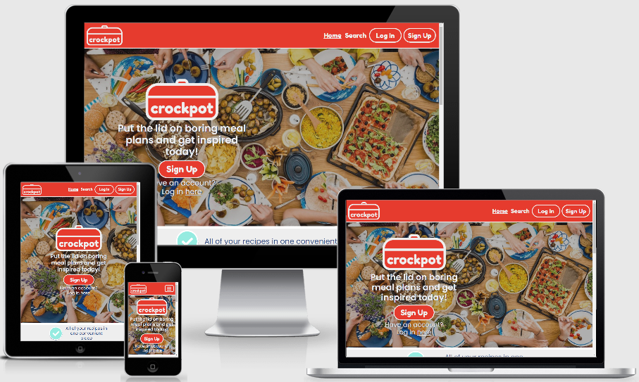
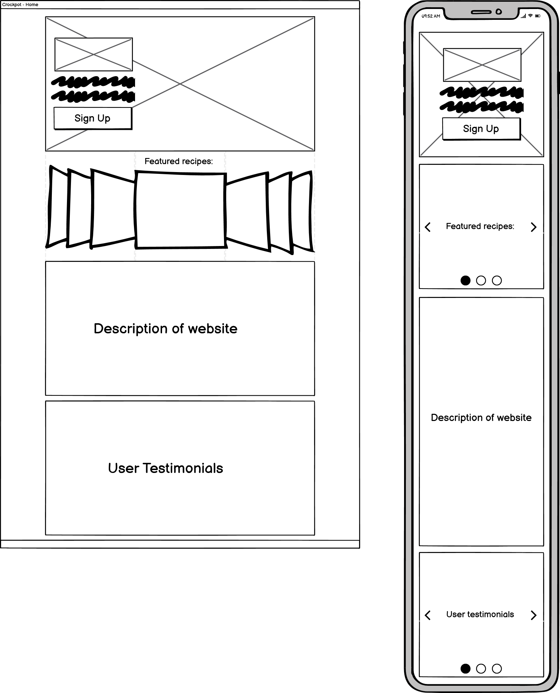
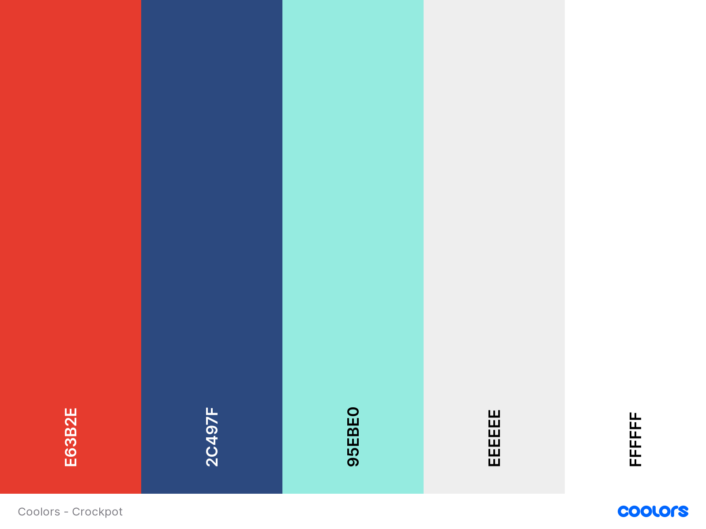
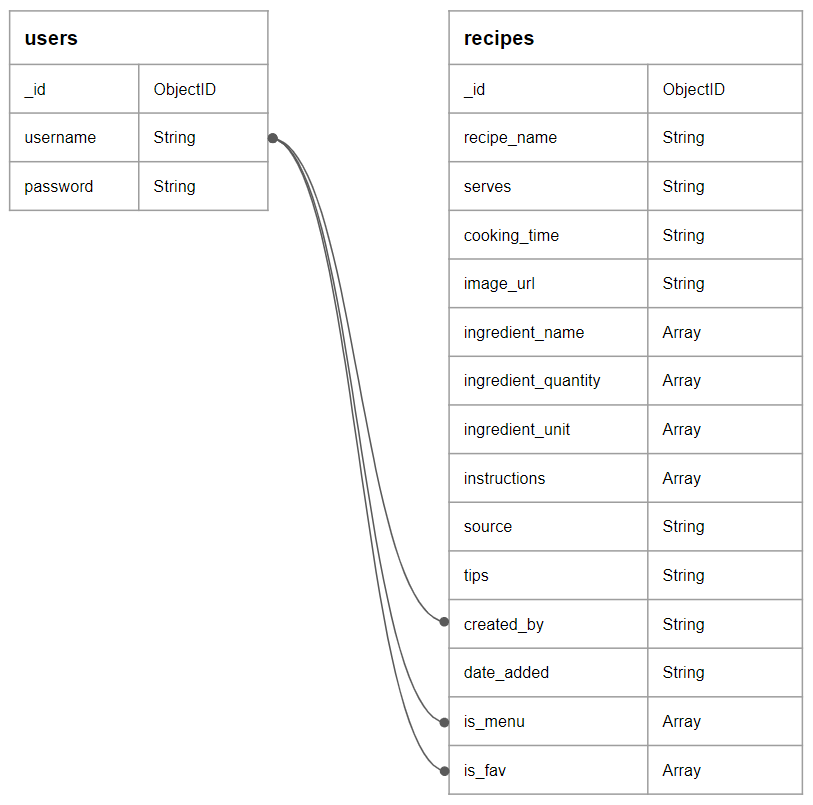

# Crockpot

## Code Institute: Milestone Project 3

_Crockpot_ is a cooking website that allows users to save all of their recipes in one convenient place, upload their old favourites to the community database, search for new inspiration based on what ingredients they have in the cupboard and generate a shopping list from their selected menu. I designed this app primarily for myself - I love cooking but hate the faff of meal planning and making shopping lists, so I wanted to design something that would make this easier for me - but it can also be used by a wider audience of cooking enthusiasts.

This was the third of four Milestone Projects required to pass the Full Stack Web Development Program at _Code Institute_. The main requirements were to build a full-stack site using HTML, CSS, JavaScript, Python, Flask and MongoDB that allows users to manage a common dataset about a particular domain.

Click **[here](https://github.com/zoet24/crockpot)** to view the Github repository for the project, and click **[here](https://crockpot.herokuapp.com/)** to view the live website.

## Table of Contents

- [UX Design](#ux-design)
    - [Design Process](#design-process)
        - [Strategy Plane](#strategy-plane)
        - [Scope Plane](#scope-plane)
        - [Structure Plane](#structure-plane)
        - [Skeleton Plane](#skeleton-plane)
        - [Surface Plane](#surface-plane)
    - [Information Architecture](#information-architecture)
    - [Features](#features)
        - [Existing features](#existing-features)
        - [Defensive design features](#defensive-design-features)
        - [Features left to implement](#features-left-to-implement)
- [Technologies Used](#technologies-used)
    - [Languages and frameworks](#languages-and-frameworks)
    - [Additional tools used](#additional-tools-used)
- [Git Commit Messages](#git-commit-messages)
- [Testing](#testing)
- [Deployment](#deployment)
- [Credits](#credits)

## UX Design
### Design Process
#### Strategy Plane 
I started the design process for _Crockpot_ by considering the goals of the developer (me), the site owner (me) and the site users (primarily me, secondarily a wider audience of new users and returning users who are interested in using an online cookbook).

_**Developer**_
1. As the developer, I want to create an online platform where users can add, edit, delete and search for recipes to complete the third _Code Institute_ Milestone Project.
2. As the developer, I want the website to be aesthetically pleasing and easy to use to demonstrate my ability to code in HTML and CSS and to create a positive UX experience for the site users.
3. As the developer, I want the website to function well to demonstrate my ability to code in JavaScript and Python and to create a positive UX experience for the site users.

_**Site owner**_
1. As the site owner, I want the site users to have a positive UX experience while using the website so that the _Crockpot_ community grows.
2. As the site owner, I want the site users to have a positive UX experience while adding, editing and deleting recipes to increase the number of communal recipes that are shared with the website.

_**Site users**_
1. As a new user, I want to be able to easily create my own profile so I can start using the website quickly.
2. As a new user, I want clear instructions on how to use the website so I can start using the website quickly.
3. As a returning user, I want to be able to easily log in to my profile so I can start using the website quickly.
4. As a site user, I want to be able to add my own recipes so all of my recipes are saved in one place.
5. As a site user, I want to be able to edit my own recipes if they need updating.
6. As a site user, I want to be able to delete my own recipes if I don't want to use them anymore.
7. As a site user, I want feedback from the website when I add, edit and delete my recipes to show that my input has been successful.
8. As a site user, I want to be able to browse the recipes I have added when I am deciding what to cook.
9. As a site user, I want to be able to browse the recipes that other users have added when I am deciding what to cook.
10. As a site user, I want clear, well-presented information about the recipe including name, cooking time, ingredients and instructions so I know how to cook the recipe.
11. As a site user, I want to be able to save my favourite recipes so they are easier to look up when I next want to cook them.
12. As a site user, I want to be able to search the communal database for recipes based on various criteria if I am looking for a specific recipe.
13. As a site user, I want to be able to access the website from both mobile and desktop browsers so I can access the website from any of my devices.
14. As a site user, I want to be able to log out of the site when I am finished using it.
15. As a site user (me), I want to be able to search the communal database for recipes based on what ingredients I have.
16. As a site user (me), I want to be able to generate a shopping list from the recipes I have selected.

#### Scope Plane
After establishing my main aims, I re-did the _Code Institute_ task manager mini project on the Backend Development module to see what features that would be realistic to implement within the time constraints of this project. I used this along with my user stories to compile a list of “must-have” features and “nice-to-have” features to include on my website. I added my requirement that the site should generate a shopping list to the “nice-to-have” list as I wasn’t sure if I would have enough time to implement it.

_**"Must-haves"**_
1. The site must be aesthetically pleasing across all devices and have a consistent theme.
2. The site must be easy to navigate and have clear instructions on how to use it.
3. New users must be able to create their own profile and returning users must be able to log in to their own profile.
4. Users must be able to add, edit and delete their own recipes, and receive feedback when they do so.
5. Information about each recipe must be clearly presented and easy to access.
6. Users must be able to “favourite” any recipe and these should display on their profile/specific page.
7. Users must be able to browse their own recipes and recipes added by other users.
8. Users must be able to search for specific recipes based on various criteria, including ingredients.

_**"Nice-to-haves"**_
1. The site could generate a shopping list based on what recipes the user has selected.
2. The site could recommend recipes to the user based on recipes they hadn’t tried before/recipes that were similar to their own/favourite recipes.
3. The site could have admin user functionality with the ability to add, edit and delete any users/recipes.
4. Users could customise aspects of their profile (eg. add profile picture, food preferences).
5. Users could connect directly with other users and view their profiles.
6. Users could rate or review recipes and this could be displayed on the recipe for other users to see.
7. Recipes could have assigned categories (eg. vegetarian, spicy, Indian) to make them easier to search for.

#### Structure Plane
Based on the features outlined in my scope and the end result of the task manager mini project, I decided that I wanted to include the following pages on my website:
- “Home”, “Search”, “Log In” and “Sign Up” when the user isn’t logged in to the site.
    - The Home page welcomes the user to the site and directs them to the Log In and Sign Up pages.
    - The Search page allows the user to browse through all the recipes on the website or search for specific recipes. Users who aren’t logged in can view recipes but they can’t add their own.
    - Individual recipes can be viewed on their own separate page by clicking on the recipe thumbnail.
    - The Log In and Sign Up pages allow the user to log in to/create their profile so they can access the full functionality of the website.
- “Profile”, “Add”, “Search” and a link to log out when the user is logged in to the site.
    - The Profile page shows the user’s own recipes, their favourite recipes and links to the rest of the website.
    - The Add page allows the user to add their own recipes through a form.

At this stage I added a “Shopping List” page to my “nice-to-have” list (which I would later rename “Menu”) - this would be a page which would generate a shopping list based on what recipes the user had added to their “Menu”. It would only be accessible if the user was logged in to the website. It was an unnecessary addition to include in the initial MVP, but I decided to be optimistic and include it in my wireframe mock-ups.

#### Skeleton Plane
I used Balsamiq to develop wireframes (click **[here](readme-wireframes.md)** to view all of them) of what I wanted my website to look like on mobile and desktop. I kept my scope at the forefront of this design process to make sure that there was going to be a place to put all of my key features.

_**Note:**_ I later decided to remove the user testimonial section from the bottom of my Home page as I didn't think it added value to the site and I liked the aesthetic of the page better without it. I also reduced the search criteria to just the recipe name and ingredients.

#### Surface Plane
After finishing my Balsamiq wireframes, I designed the _Crockpot_ logo and favicon using HTML and CSS. I chose “Fredoka One” for the logo font as I thought the rounded curves of the typeface matched the round features of the logo. I continued this theme throughout the website, opting for rounded corners and circles on buttons, icons and images. I didn’t want to use "Fredoka One" for the main body of text so used “Poppins” instead as it’s much easier to read.

I used coolors.com to select the colour scheme for the website. I wanted something bright and bold for the logo, navbar and footer - I chose the red #e63b2e because it reminded me of tomato sauce which I thought was appropriate for the website! The rest of the colour palette is a bit calmer in comparison so it doesn’t distract the user from the bulk of the information on the page. The light blue (#95EBE0) is used for clickable links throughout the website (apart from the sign up and log in links); the dark blue (#2C497F) is used to convey information as it contrasts better against the pale background.

### Information Architecture

I used Mongo DB to store the data for my site using the schema shown below.
- The user's "username" is stored in the recipe "created_by" if they are the one who made the record.
- The user's "username" is pushed/pulled from the "is_menu" and "is_fav" arrays depending on their input into the website, so multiple users can have the same recipe as their favourite or in their menu.

If I was doing this project again, I would have a third collection for ingredients to make the search function less cumbersome.

### Features
#### Existing features
_**General**_
- The site gives the user visual feedback on what are/aren't interactive elements. Non-interactive elements (eg. instructional text) are always in dark blue; interactive elements (eg. the menu, edit and delete icons and the favourite toggle) are always in light blue. Nav links underline when the user hovers over them indicating they can be clicked. The recipe tiles grow when the user hovers over them indicating they can be clicked too.
- When the user is logged in, each recipe tile will have a "Menu" icon in the top left corner. If the user has made the recipe it will also have an "Edit" and "Delete" icon in the top right corner. This is so a user can add a recipe to their menu, edit it or delete it without having to go to the main recipe page.

_**Home**_
- The logo, tag line and links to the Sign Up and Log In pages are superimposed on a colourful image of a table of food to introduce the users to the site.
- There is a description of the functionality of the website to inform the user what they would be able to do with an account.
- There is a selection of the most recently added recipes that the user can browse through.

_**Sign Up/Log In**_
- The background image and layout of these pages is consistent with the Home page.
- Users can create an account/log in to an existing account using the form.
- If they enter an incorrect combination of username/password, or if they try to sign up with a username that has already been taken then they are informed via flashed message.
- If they enter a username or password with an incompatible combination of characters they are informed via pop-up.
- If they successfully enter the site they are greeted via flashed message on the profile page.

_**Profile**_
- The user is greeted with their username at the top of the page.
- If the user has made recipes, they can see all of them at the top of the page (in a carousel for mobile devices, as tiles for larger devices).
- If the user hasn't made any recipes yet, they see instructions on how to add a recipe. The icons for "Edit" and "Delete" are used consistently throughout the site.
- There are links to the Add, Search and Menu pages in the centre of the page.
- If the user has favourite recipes, they can see all of them at the bottom of the page (in a carousel for mobile devices, as tiles for larger devices).
- If the user hasn't got any favourite recipes yet, they see instructions on how to view a recipe and how to favourite it.

_**Add Recipe**_
- The user can save information about their new recipe using the form.
- The user can upload an image for the recipe via a URL; if no image is added then a placeholder of the _Crockpot_ logo is added instead.
- The sliders use a JavaScript function to display the slider value.
- The ingredients and instructions dropdown menus using a JavaScript function to add/remove additional form rows.
- The recipe name and ingredients name are saved without spaces to improve the specificity of the search funciton (ie. "Hot chilli powder" would be saved as "HotChilliPowder").
- If there are issues with the input the user is informed of the error via pop-up.
- If the user successfully submits the recipe they are returned to their profile page and told via flashed message.

_**Edit Recipe**_
- The user can access the edit page from the recipe tile or the recipe page.
- The layout is the same as the Add page.
- A JavaScript function fills the ingredients and instructions with the correct number of lines.
- A Python function adds spaces between capital letters in the ingredients names (ie. HotChilliPowder is rendered as Hot Chilli Powder).
- If there are issues with the input the user is informed of the error via pop-up.
- If the user successfully saves their changes they are returned to their profile page and told via flashed message.

_**View Recipe**_
- The user can view clearly presented information about the recipe.
- The user can add/remove the recipe from their menu using the "Menu" icon. If they created the recipe they will also be able to edit/delete the recipe using the icons too.
- The user can add/remove the recipe from their favourites using the toggle.
- If the user added a image URL it will be displayed; if they did not there will be an image of the _Crockpot_ logo as a placeholder.
- If the user added "Top Tips" and a "Source" for their recipe it will be visible at the bottom of the page; if these sections were left out nothing will be rendered.

_**Search Recipe**_
- The user can search for a recipe by entering a recipe name into the search bar, and/or selecting ingredients from the dropdown list at the top of the page.
- The ingredients dropdown menu shows all of the unique ingredients from all of the ingredients on the database.
- A JavaScript function adds all of the values of the checked ingredients boxes to the query text in the search bar when the user submits their search.
- A Python function then splits this string into recipe name and ingredients and will query the database in different ways depending on what the user has searched.
- If the user has searched for a recipe name and ingredients, it will query the database using an "and" function and will return recipes that match the recipe name and have all of the selected ingredients.
- If the user has searched for just a recipe name, it will return recipes that match the recipe name with any ingredients.
- If the user has searched for just a selection of ingredients, it will return recipes that have all of the selected ingredients.
- If there are no matches with the user's search, they see instructions on how to reset their search and start again.

_**Menu**_
- The user can add/remove a recipe to their "Menu" from the recipe tile or the recipe page. If they have successfully added/removed the recipe they will be told via flashed message.
- If the user has recipes on their "Menu", they can see all of them at the top of the page. The dropdown "Shopping List" will sum all of the ingredients in the selected recipes and the user can mark what they do/do not have.
- If the user hasn't made any recipes yet, they see instructions on how to do it. After this they will see a list of recommended recipes.

#### Defensive design features
- Attributes "min-length", "max-length", "pattern" and "required" controls what data the user can/cannot enter in to the database.
- The "type" attribute for the image url entries is set to "url" to check that the user is inputting a valid link.
- Blank form entries (apart from a few specific fields) are blocked.
- When the input is invalid, user receives feedback through multiple methods - "oninvalid" is used to customise the error message or a relevant flashed message is shown.
- At the suggestion of my tutor Can Sucullu, I added extra defensive checks to the edit and delete Python functions. If the user did not create the recipe, the HTML will not render the edit and delete buttons on the recipe card. Can suggested that I add an extra line of code at the start of the edit and delete functions to double check if the user created the recipe, to prevent malicious users from manipulating the site.

#### Features left to implement
- Admin functionality
- Recipe recommendation based on what the user has favourited
- Allow users to customise their profiles
- Allow users to add additional ingredients to their shopping list outside of what is on their selected recipes
- Allow users to directly upload images instead of linking them with a URL
- Add categories to recipes for extra search functionality
- Improve specificity of search function (add more filters, make most relevant searches appear first)
- Make ingredient quantity a function of serving portion (so you could add a recipe to your menu with a specific serving portion in mind)
- Implement a rating/user comments section for each recipe
- Functional social media links in the footer (currently they just redirect to the main social media site as Crockpot isn't a real company!)
- A way to remind users of log in credentials if they have forgotten them

## Technologies used
### Languages and frameworks
- __HTML5:__ The language used to create the content and structure of my project.
- __CSS3:__ The language used to style the HTML5 elements to create the aesthetic of my site.
- __JavaScript and JQuery:__ One of the languages used to add extra functionality to my site.
- __Python:__ The language used to write the logic that controls my site.
- __Bootstrap framework:__ I used the Bootstrap grid system to make my site responsive on different devices. I also used it for the carousel and modal components throughout the site.
- __Flask framework:__ I used the Flask framework to manage the HTML5 more efficiently.
- __GitHub:__ I used GitHub to store my source code and repository.
- __Gitpod:__ I used Gitpod's development environment to write the code for my project.
- __Heroku:__ I used Heroku to deploy my project and make it viewable to others.
- __MongoDB Atlas:__ I used MongoDB to store the data that is displayed on my site.

### Additional tools used
- __Amiresponsive:__ I used this to produce the main image for my readme file and to test the responsiveness of my website.
- __Balsamiq:__ I used this to produce wireframe sketches for the site's skeleton plane.
- __CompressPNG:__ I used this to compress the static images to improve performance.
- __Coolors:__ I used this to select the colour scheme for my site.
- __FontAwesome:__ I used FontAwesome's database for basic icons throughout my site.
- __FreeFormatter:__ I used Freeformatter.com to format my code properly.
- __Google Developer Tools:__ I used this to test the responsiveness of my website by viewing my project on devices with different screen sizes. I also used the Console to test different functions in my JavaScript code throughout development, and the Lighthouse package to test the performance of the site.
- __Google Fonts:__ I used two complementary fonts from Google Fonts for my project - Fredoka One and Poppins.
- __JSHint:__ I used this to test to the validity of my JavaScript and JQuery code.
- __PEP8Online:__ I used this to test the compliance of my Python code.
- __W3C CSS Validation Service:__ I used this to test to the validity of my CSS code.
- __W3C Markup Validation Service:__ I used this to test the validity of my HTML5 code.

## Git Commit Messages
I continued using the git commit format style that I had developed during my MS1 and MS2 projects. I used the imperative tense for all messages; I referred to all pages with their full name (ie. index.html instead of index); I denoted bug fixes by including "Bug" at the start of the message; all messages were under 50 characters. I've included 10 git commit messages below to demonstrate the syntax.
- **e1c8235** 2021-02-11 - Update addRecipe function to replace spaces with -s in recipe_name
- **9e2c59b** 2021-02-11 - Add placeholder image for recipes without image_url
- **a5aaa1e** 2021-02-10 - Start on responsive design on index.html
- **106b100** 2021-02-09 - Complete first validation of all html
- **84dcb29** 2021-02-09 - Bug #2 fix: Slicing issue on searchRecipe.html resolved
- **e4ef097** 2021-02-09 - Update app.js and profile.html to remove duplicate id attributes
- **1391460** 2021-02-09 - Update addRecipe.js to update ingredients and instrucitons attributes
- **e7cbabe** 2021-02-09 - Remove carousel control if recipe.count == 1
- **6cc9bea** 2021-02-09 - Update featured recipes to 3 most recent DB entries
- **89b7774** 2021-02-09 - Add defensive programming for addRecipe.html form

## Testing
Click **[here](readme-testing.md)** to view the complete testing process.

## Deployment
To deploy my project I followed the steps outlined in the "Deploying Our Project To Heroku" video in the _Code Institute_ Backend Development module which are as follows:
1. Go to your Github repository and open it using GitPod index
2. In the terminal run the command "pip3 freeze --local > requirements.txt" to create a .txt file with all of the dependencies for Heroku
3. In the terminal run the command "echo web: python run.py > Procfile" to create a Procfile for Heroku
4. Check the Procfile - if it has a blank line under the first line, delete it
5. Log in to Heroku and on your dashboard select "Create New App"
6. Under "Create New App" select the input field "App Name"
7. Give your app a unique name using dashes instead of spaces
8. Select the region closest to your location
9. Click "Create App"
10. To connect the app to your Github repository, click on the Github icon inside of the "Deployment Method" section
11. Under "Deployment Method" there will be a new section called "Connect to Github" - make sure that your Github profile is displayed inside it
12. Insert your repo name inside the "Connect to Github" section next to where your profile is displayed
13. Click "Search", and once it finds your repo click the "Connect" button
14. Click on the settings tab at the top of the page, and select "Reveal Config Var"
15. Do not include quotes for the key or the value
16. Add variables for IP, PORT, MONGO_URI, MONGODB_NAME and SECRET_KEY
17. Return to the Gitpod IDE and make sure you have pushed the requirements.txt and Procfile
18. Return to Heroku and select "Enable Automatic Deployment"
19. Select your master branch under "Branch Selected"
20. Click "Deploy Branch" - it will take some time for Heroku to build the app
21. Once the site is deployed, click "View" to launch the app

To run the code locally:
1. Go to the Github repository and download a zip file with all of the files required to run the website
2. Once you have downloaded them, use an IDE like Sublime or VSCode to open them
3. Run the server locally from your IDE
4. In order for the app to function you will need to create your own MongoDB collection and insert that "MONGO_URI" in to the config vars

## Credits
__Images:__
Most of the images on the website at the point of submission are taken from https://www.hellofresh.co.uk/.

__Code:__
I used the following snippets of code for components on my site (they are also credited in comments with the code too):
- The toggle switch for favouriting and un-favouriting recipes is from https://www.w3schools.com/howto/tryit.asp?filename=tryhow_css_switch
- The sliders for choosing the serving portion and cooking time is from https://www.w3schools.com/howto/howto_js_rangeslider.asp
- The ingredients checkboxes on the search and menu pages are from https://codepen.io/quinlo/pen/ReMRXz
- The basis for the adding/deleting extra instructions and ingredients on the Add Recipe and Edit Recipe pages is from https://github.com/Manojlovic1998/Milestone_Project_3/blob/master/static/js/addRecipe.js

This project was initially based off of the _Code Institute_ task manager mini project on the Backend Development module, but the end result has been heavily modified.

__Acknowledgements:__
I'd like to thank my tutor Can Sucullu, the _Code Institute_ community (specifically members Eamonn and Ed B Lead who helped me rewrite my search function) and my friends and family for their guidance and input on this project.

